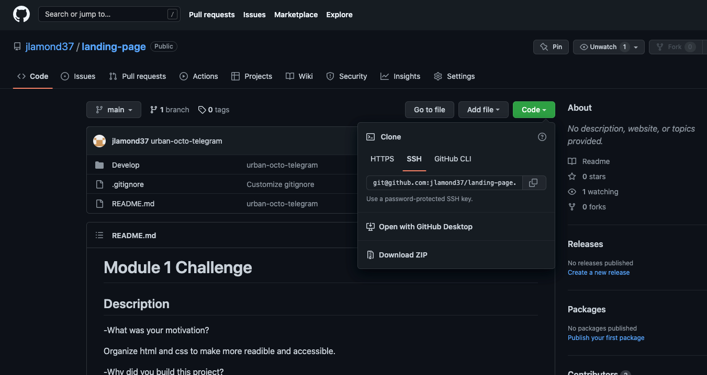

# Module 1 Challenge

## Description

-What was your motivation?

Organize html and css to make more readible and accessible.

-Why did you build this project?

Making html more accessible makes webiste to be optimized for search engines.

-What problem did it solve?

More organization and easier to read and debug.

-What did you learn?

How to properly structure and organize css and html. 

## Usage

Provide instructions and examples for use. Include screenshots. 

-Clone repository onto computer through Github by clicking on the code button and copying the SSH key through this link <a>https://github.com/jlamond37/landing-page</a> 

-Right click and hit "Open in default browser"

-Link for site: <a>https://jlamond37.github.io/landing-page/</a>

## Credits

Collaborated with Freddy Kwak and Sean Dillon.

